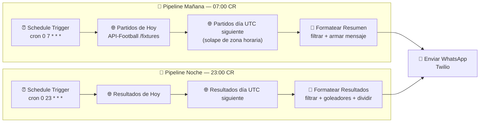

# ⚽ Alertas Diarias del Mundial 2026 — WhatsApp

> Notificaciones automáticas por **WhatsApp** sobre partidos de fútbol internacional de selecciones del **Mundial FIFA 2026** — construido con **n8n**, **Twilio** y la API REST de **API-Football**, desplegado en producción sobre **Railway**.

[](https://n8n.io)
[](https://www.twilio.com/whatsapp)
[](https://railway.app)
[](LICENSE)

🇬🇧 *Prefer English?* → [**README.md**](README.md)

---

## 📖 Resumen

Cada día este workflow envía dos resúmenes automáticos por WhatsApp a una lista de destinatarios:

| ⏰ Hora (CR) | 📨 Qué envía |
| :--- | :--- |
| **07:00 — Mañana** | Vista previa de los **partidos de hoy** con horas de inicio (local) |
| **23:00 — Noche** | **Resultados finales** con goleadores, minutos y etiquetas de penal/autogol |

Ambos resúmenes se filtran para incluir solo lo importante: selecciones **clasificadas/eliminatorias del Mundial 2026**, en las competiciones de **Mundial** y **Amistosos Internacionales** — categorías juveniles excluidas.

> **Caso de uso:** un grupo de amigos y familia en Costa Rica que quiere un resumen diario limpio, sin spam, del fútbol relevante para el Mundial, directo en WhatsApp — sin app, sin feed, sin ruido.

---

## 🖼️ Capturas

> _Reemplaza estos placeholders con capturas reales._

| Workflow en n8n | Resultado en WhatsApp |
| :---: | :---: |
|  |  |

---

## 🧠 Cómo funciona



### Decisiones de diseño clave

- **Límites de día correctos por zona horaria.** Costa Rica es `UTC-6`. Un partido a las 8pm CR cae en el día UTC *siguiente*, así que cada pipeline consulta **ambos** días (hoy y mañana en UTC), deduplica y recorta todo de vuelta al **día calendario de Costa Rica** con Luxon. Esto evita el clásico bug de "partidos de la noche que desaparecen".
- **Filtrado de negocio en código.** Solo ligas `1` (Mundial) y `10` (Amistosos); solo selecciones del Mundial 2026; equipos juveniles (`U17`, `U20`, `U23`…) excluidos con regex.
- **Resultados enriquecidos.** El resumen nocturno llama al endpoint `/fixtures/events` por cada partido finalizado para listar **goleadores con minuto**, más etiquetas `(P)` penal y `(OG)` autogol, acreditando correctamente los autogoles al rival.
- **División segura para WhatsApp.** Los días con muchos resultados se dividen en mensajes de ≤1500 caracteres para que el proveedor no trunque nada.
- **Envío masivo (fan-out).** Un único mensaje formateado se envía a todos los destinatarios en una sola ejecución.

---

## 🛠️ Stack y técnicas

| Área | Tecnología / Técnica |
| :--- | :--- |
| Orquestación | **n8n** (Schedule, HTTP Request, Code, Twilio) |
| Mensajería | **API de WhatsApp de Twilio** |
| Fuente de datos | **API-Football** (`v3.football.api-sports.io`) |
| Programación | Expresiones **cron** (`0 7 * * *`, `0 23 * * *`) |
| Lógica | Code nodes en JavaScript · fechas con Luxon · filtros regex · dedup |
| Despliegue | **Railway** (localhost → producción en la nube) |
| Secretos | Variables de entorno + Credenciales de n8n (fuera del código) |

---

## ✅ Requisitos previos

Antes de importar, asegúrate de tener:

1. Una instancia de **n8n** en ejecución (self-hosted, Railway o n8n Cloud).
2. Una API key de **API-Football** — regístrate en [api-football.com](https://www.api-football.com/).
3. Una cuenta de **Twilio** con el remitente de **WhatsApp** habilitado (el [Sandbox](https://www.twilio.com/console/sms/whatsapp/learn) sirve para pruebas).
4. Números de WhatsApp (en formato **E.164**, ej. `+50688889999`) de tus destinatarios.

---

## 🚀 Instalación e importación

1. **Clona el repo**
   ```bash
   git clone https://github.com/imkhub1/n8n-wc2026-football-alerts.git
   cd n8n-wc2026-football-alerts
   ```

2. **Importa el workflow en n8n**
   - Abre el editor de n8n → menú superior derecho → **Import from File**.
   - Selecciona [`workflow/wc2026-football-alerts.json`](workflow/wc2026-football-alerts.json).

3. **Configura entorno / secretos** (ver siguiente sección).

4. **Activa** el workflow. Los dos triggers programados empezarán a dispararse a las 07:00 y 23:00 en tu zona horaria configurada.

---

## 🔐 Configurar credenciales (sin secretos en el código)

Este repositorio se publica **con todos los secretos reales eliminados**. Placeholders que debes reemplazar:

| Placeholder en el JSON | Qué es | Dónde poner el valor real |
| :--- | :--- | :--- |
| `YOUR_API_FOOTBALL_KEY` | API key de API-Football | Header `x-apisports-key` en los nodos HTTP (o una credencial **Header Auth** de n8n) |
| `+10000000001 … 5` | Números de WhatsApp destino | El array `recipients` dentro de los dos nodos **Code** |
| Credencial de Twilio | Account SID / Auth Token | **Credentials → Twilio API** en n8n (mapeada por nombre `Twilio account`) |

Copia [`.env.example`](.env.example) a `.env` y completa tus valores:

```bash
cp .env.example .env
```

> 💡 **Recomendado:** en lugar de incrustar la API key en los nodos HTTP, crea una credencial **Header Auth** en n8n y referénciala — así la key nunca queda en el JSON exportado.

---

## ☁️ Despliegue: localhost → Railway

Este proyecto comenzó en **localhost** para desarrollo y luego fue promovido a un **despliegue de producción en [Railway](https://railway.app)** para correr 24/7 y probarlo con amigos y familia reales.

### ¿Por qué Railway?
- Despliegue de n8n con **volumen persistente** y **PostgreSQL** administrado.
- Un **dominio HTTPS público** desde el inicio — necesario para el editor, los webhooks y los callbacks OAuth de n8n.
- Gestión simple de **variables de entorno** para los secretos.
- Económico y siempre activo, ideal para una automatización personal que debe ejecutarse en un cron diario.

### Qué cambió de local a producción

| Aspecto | Localhost (dev) | Railway (producción) |
| :--- | :--- | :--- |
| Base de datos | Archivo SQLite | **PostgreSQL** (administrado, persistente) |
| Acceso público | `localhost:5678` | **Dominio HTTPS público** (`*.up.railway.app`) |
| Webhooks | no accesibles | `WEBHOOK_URL` apuntando al dominio público |
| Secretos | `.env` en mi máquina | **Variables de entorno de Railway** |
| Cifrado de credenciales | clave local | `N8N_ENCRYPTION_KEY` estable como env var |
| Zona horaria | default del sistema | `GENERIC_TIMEZONE=America/Costa_Rica` |

### Variables de entorno principales de producción

```env
N8N_HOST=tu-instancia.up.railway.app
N8N_PROTOCOL=https
WEBHOOK_URL=https://tu-instancia.up.railway.app/
GENERIC_TIMEZONE=America/Costa_Rica

DB_TYPE=postgresdb
DB_POSTGRESDB_HOST=...
DB_POSTGRESDB_DATABASE=n8n
DB_POSTGRESDB_USER=n8n
DB_POSTGRESDB_PASSWORD=...

N8N_ENCRYPTION_KEY=<clave-aleatoria-estable-32+-chars>
```

> ⚠️ Mantén `N8N_ENCRYPTION_KEY` **estable** entre redeploys — si cambia, n8n ya no puede descifrar las credenciales guardadas.

Ver [`.env.example`](.env.example) para la lista completa y anotada.

---

## ⭐ Técnicas destacadas (para reclutadores)

Un mapa rápido de las competencias de ingeniería que demuestra este proyecto:

- **☁️ Despliegue en la nube** — prototipo local promovido a un servicio de producción real en Railway (Postgres administrado, almacenamiento persistente, dominio HTTPS público).
- **🔐 Gestión de secretos** — todas las credenciales externalizadas a variables de entorno / Credenciales de n8n; el repo es seguro de publicar sin filtrar secretos.
- **🕓 Programación correcta por zona horaria** — manejo robusto del problema de límite de día `UTC ↔ UTC-6` con Luxon, evitando partidos nocturnos perdidos.
- **🔌 Integración con APIs de terceros** — llamadas secundarias a API-Football, incluyendo una llamada por partido para enriquecer resultados con goleadores.
- **🧹 Transformación de datos** — dedup, filtrado por reglas de negocio, exclusiones con regex y división de mensajes según el proveedor.
- **📲 Envío masivo de notificaciones** — un único payload calculado entregado a N destinatarios por ejecución.
- **📚 Documentación y DX** — export importable, `.env.example` anotado, documentación bilingüe y sticky notes en el canvas explicando cada rama.

---

## 📂 Estructura del repositorio

```
.
├── workflow/
│   └── wc2026-football-alerts.json   # Workflow de n8n importable (sin secretos)
├── docs/
│   ├── workflow-canvas.png           # Placeholder de captura
│   └── whatsapp-result.png           # Placeholder de captura
├── .env.example                      # Variables de entorno anotadas
├── .gitignore
├── LICENSE                           # MIT
├── README.md                         # Versión en inglés
└── README.es.md                      # Estás aquí
```

---

## 📜 Licencia

Publicado bajo la [Licencia MIT](LICENSE). Siéntete libre de clonar, adaptar y desplegar tu propia versión.

---

## 🙋 Autor

Construido por [**@imkhub1**](https://github.com/imkhub1). Si te resultó útil o tienes ideas, los issues y PRs son bienvenidos.
