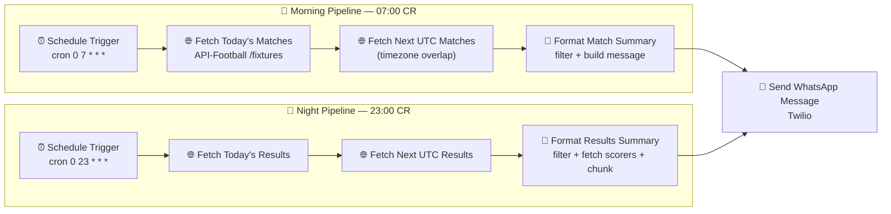

# WC2026 Daily Match Alerts — WhatsApp

> Automated **WhatsApp** notifications for international football matches involving **FIFA World Cup 2026** nations — built with **n8n**, **Twilio** and the **API-Football** REST API, and deployed to production on **Railway**.

[](https://n8n.io)
[](https://www.twilio.com/whatsapp)
[](https://railway.app)
[](LICENSE)

🇪🇸 *¿Prefieres español?* → [**README.es.md**](README.es.md)

---

## 📖 Overview

Every day this workflow sends two automated WhatsApp digests to a list of recipients:

| ⏰ When (CR time) | 📨 What it sends |
| :--- | :--- |
| **07:00 — Morning** | Preview of **today's matches** with kickoff times (local) |
| **23:00 — Night** | **Final results** with goal scorers, minutes and penalty/own-goal tags |

Both digests are filtered to only the matches that matter: national teams that are **World Cup 2026 qualifiers**, in the **World Cup** and **International Friendlies** competitions — youth squads excluded.

> **Use case:** a group of friends and family in Costa Rica who want a clean, spam-free daily summary of World Cup-relevant football, delivered straight to WhatsApp — no app, no feed, no noise.

---

## 🖼️ Screenshots

> _Replace these placeholders with real captures._

| n8n Workflow | WhatsApp Result |
| :---: | :---: |
|  |  |

---

## 🧠 How it works



### Key design decisions

- **Timezone-correct day boundaries.** Costa Rica is `UTC-6`. A match at 8pm CR falls on the *next* UTC calendar day, so each pipeline fetches **both** today and tomorrow (UTC), then deduplicates and clips everything back to the **Costa Rica calendar day** using Luxon. This avoids the classic "missing evening matches" bug.
- **Business filtering in code.** Only leagues `1` (World Cup) and `10` (Friendlies); only WC2026-qualified nations; youth teams (`U17`, `U20`, `U23`…) excluded via regex.
- **Rich results.** The night digest calls the `/fixtures/events` endpoint per finished match to list **scorers with minute**, plus `(P)` penalty and `(OG)` own-goal tags, correctly crediting own goals to the opposing side.
- **WhatsApp-safe chunking.** Long result days are split into ≤1500-character messages so nothing is truncated by the provider.
- **Fan-out delivery.** A single formatted message is fanned out to every recipient in one execution.

---

## 🛠️ Stack & techniques

| Area | Tech / Technique |
| :--- | :--- |
| Orchestration | **n8n** (Schedule triggers, HTTP Request, Code, Twilio nodes) |
| Messaging | **Twilio WhatsApp API** |
| Data source | **API-Football** (`v3.football.api-sports.io`) |
| Scheduling | **Cron** expressions (`0 7 * * *`, `0 23 * * *`) |
| Logic | JavaScript Code nodes · Luxon date math · regex filters · dedup |
| Deployment | **Railway** (localhost → cloud production) |
| Secrets | Environment variables + n8n Credentials (kept out of code) |

---

## ✅ Prerequisites

Before importing, make sure you have:

1. A running **n8n** instance (self-hosted, Railway, or n8n Cloud).
2. An **API-Football** API key — sign up at [api-football.com](https://www.api-football.com/).
3. A **Twilio** account with the **WhatsApp** sender enabled ([Sandbox](https://www.twilio.com/console/sms/whatsapp/learn) works for testing).
4. WhatsApp numbers (in **E.164** format, e.g. `+50688889999`) for your recipients.

---

## 🚀 Installation & import

1. **Clone the repo**
   ```bash
   git clone https://github.com/imkhub1/n8n-wc2026-football-alerts.git
   cd n8n-wc2026-football-alerts
   ```

2. **Import the workflow into n8n**
   - Open your n8n editor → top-right menu → **Import from File**.
   - Select [`workflow/wc2026-football-alerts.json`](workflow/wc2026-football-alerts.json).

3. **Configure environment / secrets** (see next section).

4. **Activate** the workflow. The two schedule triggers will start firing at 07:00 and 23:00 in your configured timezone.

---

## 🔐 Configuring credentials (no secrets in code)

This repository ships **with all real secrets removed**. Placeholders you must replace:

| Placeholder in the JSON | What it is | Where to set the real value |
| :--- | :--- | :--- |
| `YOUR_API_FOOTBALL_KEY` | API-Football key | HTTP Request header `x-apisports-key` (or an n8n **Header Auth** credential) |
| `+10000000001 … 5` | Recipient WhatsApp numbers | The `recipients` array inside the two **Code** nodes |
| Twilio credential | Account SID / Auth Token | n8n **Credentials → Twilio API** (mapped by name `Twilio account`) |

Copy [`.env.example`](.env.example) to `.env` and fill in your values:

```bash
cp .env.example .env
```

> 💡 **Recommended:** instead of hardcoding the API key in the HTTP nodes, create an n8n **Header Auth** credential and reference it — that way the key never lives in the exported JSON.

---

## ☁️ Deployment: localhost → Railway

This project started on **localhost** for development and was then promoted to a **production deployment on [Railway](https://railway.app)** so it could run 24/7 and be tested with real friends and family.

### Why Railway?
- One-click n8n deployment with a **persistent volume** and managed **PostgreSQL**.
- A **public HTTPS domain** out of the box — required for n8n's editor, webhooks and OAuth callbacks.
- Simple **environment-variable** management for secrets.
- Cheap/always-on, ideal for a personal automation that must fire on a daily cron.

### What changed going from local to production

| Concern | Localhost (dev) | Railway (production) |
| :--- | :--- | :--- |
| Database | SQLite file | **PostgreSQL** (managed, persistent) |
| Public access | `localhost:5678` | **Public HTTPS domain** (`*.up.railway.app`) |
| Webhooks | not reachable | `WEBHOOK_URL` set to the public domain |
| Secrets | `.env` on my machine | **Railway environment variables** |
| Credential encryption | local key | stable `N8N_ENCRYPTION_KEY` env var |
| Timezone | system default | `GENERIC_TIMEZONE=America/Costa_Rica` |

### Core production environment variables

```env
N8N_HOST=your-instance.up.railway.app
N8N_PROTOCOL=https
WEBHOOK_URL=https://your-instance.up.railway.app/
GENERIC_TIMEZONE=America/Costa_Rica

DB_TYPE=postgresdb
DB_POSTGRESDB_HOST=...
DB_POSTGRESDB_DATABASE=n8n
DB_POSTGRESDB_USER=n8n
DB_POSTGRESDB_PASSWORD=...

N8N_ENCRYPTION_KEY=<stable-random-32+-chars>
```

> ⚠️ Keep `N8N_ENCRYPTION_KEY` **stable** across redeploys — if it changes, n8n can no longer decrypt previously saved credentials.

See [`.env.example`](.env.example) for the full annotated list.

---

## ⭐ Highlighted techniques (for reviewers)

A quick map of the engineering competencies this small project demonstrates:

- **☁️ Cloud deployment** — promoted a local prototype to a real production service on Railway (managed Postgres, persistent storage, public HTTPS domain).
- **🔐 Secrets management** — all credentials externalized to environment variables / n8n Credentials; repo is safe to publish with zero leaked secrets.
- **🕓 Timezone-correct scheduling** — robust handling of the `UTC ↔ UTC-6` day-boundary problem with Luxon, avoiding missed late-evening fixtures.
- **🔌 Third-party API integration** — paginated/secondary calls to API-Football, including a per-match secondary call to enrich results with scorers.
- **🧹 Data shaping** — dedup, business-rule filtering, regex exclusions and provider-aware message chunking.
- **📲 Notification fan-out** — single computed payload delivered to N recipients per run.
- **📚 Documentation & DX** — importable export, annotated `.env.example`, bilingual docs, and in-canvas sticky notes explaining each branch.

---

## 📂 Repository structure

```
.
├── workflow/
│   └── wc2026-football-alerts.json   # Importable n8n workflow (secrets scrubbed)
├── docs/
│   ├── workflow-canvas.png           # Screenshot placeholder
│   └── whatsapp-result.png           # Screenshot placeholder
├── .env.example                      # Annotated environment variables
├── .gitignore
├── LICENSE                           # MIT
├── README.md                         # You are here
└── README.es.md                      # Spanish version
```

---

## 📜 License

Released under the [MIT License](LICENSE). Feel free to clone, adapt and deploy your own version.

---

## 🙋 Author

Built by [**@imkhub1**](https://github.com/imkhub1). If you found this useful or have ideas, issues and PRs are welcome.
